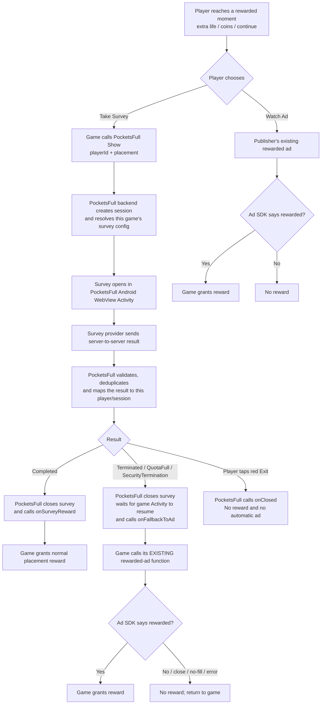
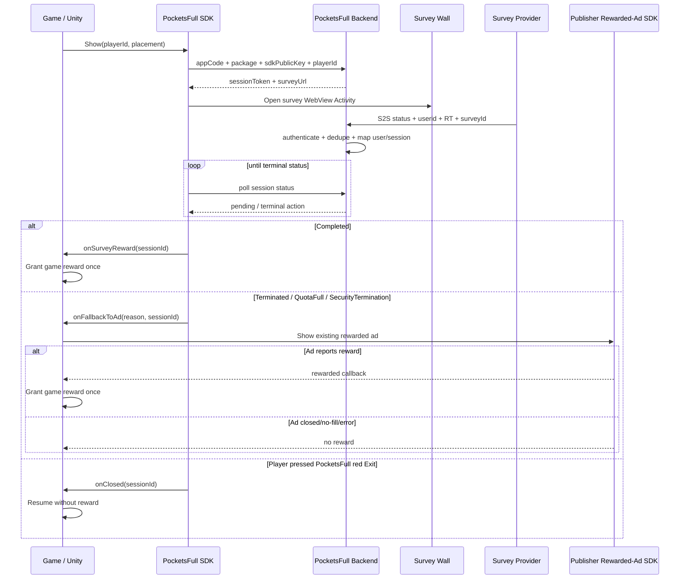

# PocketsFull Monetize SDK

**Current release:** v1.0.0  
**Platform:** Android, including Unity Android through the included bridge

PocketsFull Monetize SDK adds surveys as an optional rewarded path alongside a game's existing rewarded-ad setup. It does **not** replace, initialize, load, or mediate the publisher's ad SDK.

## One SDK for every Android game

The same Android AAR is used for every publisher/game. Game-specific survey configuration is resolved server-side from the game's `appCode`, exact Android package name, and `sdkPublicKey`.

The survey app ID, survey key, provider postback token, and backend service credentials stay server-side and are not embedded in the SDK.

## Packages

| Target | File | Guide |
|---|---|---|
| Native Android | `dist/android/PocketsFullMonetize-1.0.0.aar` | [Android integration](docs/ANDROID-INTEGRATION.md) |
| Unity Android | `dist/unity/PocketsFullMonetize-Unity-1.0.0.unitypackage` | [Unity integration](docs/UNITY-INTEGRATION.md) |
| All publishers | — | [Publisher integration contract](docs/PUBLISHER-INTEGRATION.md) |

## End-to-end flow

## Technical sequence

## Callback contract

| Outcome | PocketsFull callback | Publisher action |
|---|---|---|
| Provider `Completed` | `onSurveyReward` | Grant the placement reward once |
| Provider `Terminated` | `onFallbackToAd` | Show existing rewarded ad |
| Provider `Overquota` / `QuotaFull` | `onFallbackToAd` | Show existing rewarded ad |
| Provider `SecurityTermination` | `onFallbackToAd` | Show existing rewarded ad |
| Player presses native red Exit | `onClosed` | Resume without reward; do not auto-show ad |
| Client/SDK error | `onError` | Do not grant a survey reward; use normal error UX |

## Reward safety rule

`onFallbackToAd` means **show the publisher's existing rewarded ad**. It does not mean the player has earned a reward. Only the publisher's ad SDK rewarded callback should grant the ad reward.

## Documentation

- [Publisher integration contract](docs/PUBLISHER-INTEGRATION.md)
- [Unity integration](docs/UNITY-INTEGRATION.md)
- [Native Android integration](docs/ANDROID-INTEGRATION.md)
- [Game-state and rewarded-ad fallback](docs/GAME-STATE-AND-AD-FALLBACK.md)
- [Callback and status contract](docs/CALLBACK-CONTRACT.md)
- [Troubleshooting and test checklist](docs/TROUBLESHOOTING.md)
