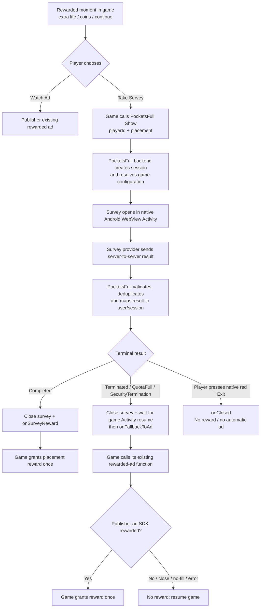

# PocketsFull Monetize SDK

**Release:** v1.0.0  
**Platform:** Android + Unity Android  
**Integration model:** Surveys alongside the publisher's existing rewarded-ad stack

PocketsFull Monetize SDK lets a game offer **Take Survey** as an additional way to earn an existing in-game reward. It does not replace, initialize, load, or mediate the publisher's ad SDK. If a survey ends as Terminated, QuotaFull/Overquota, or SecurityTermination, PocketsFull returns control to the game and calls the publisher's existing rewarded-ad fallback.

## One SDK for every Android game

The same `PocketsFullMonetize-1.0.0.aar` can be used across Android games. Unity uses the same AAR through the included thin C# bridge.

Each game receives only:

```text
appCode
sdkPublicKey
expected Android package name
```

Game-specific survey `appId`, survey key, provider postback credentials, and backend service credentials remain server-side. This means survey configuration can change without rebuilding the SDK.

## Packages

| Target | SDK | Guide |
|---|---|---|
| Native Android | `dist/android/PocketsFullMonetize-1.0.0.aar` | [Android Integration](docs/ANDROID-INTEGRATION.md) |
| Unity Android | `dist/unity/PocketsFullMonetize-Unity-1.0.0.unitypackage` | [Unity Integration](docs/UNITY-INTEGRATION.md) |
| Any publisher | — | [Publisher Integration Contract](docs/PUBLISHER-INTEGRATION.md) |

## Runtime architecture



## Technical sequence


## Callback contract

| Outcome | SDK callback | Publisher action |
|---|---|---|
| Provider `Completed` | `onSurveyReward` | Grant the requested game reward once |
| Provider `Terminated` | `onFallbackToAd` | Show existing rewarded ad |
| Provider `Overquota` / `QuotaFull` | `onFallbackToAd` | Show existing rewarded ad |
| Provider `SecurityTermination` | `onFallbackToAd` | Show existing rewarded ad |
| Player presses native red Exit | `onClosed` | Resume without reward; do not auto-show ad |
| Client/SDK error | `onError` | No survey reward; follow the game's normal error UX |

## The most important ad rule

`onFallbackToAd` means **show the existing rewarded ad**. It does **not** mean the reward was earned.

Correct:

```text
onFallbackToAd
    -> call publisher's existing rewarded-ad placement
    -> wait for the ad SDK rewarded callback
    -> grant the reward
```

Incorrect:

```text
onFallbackToAd
    -> grant reward immediately   <-- do not do this
    -> show ad
```

## Unity game-state rule

PocketsFull's survey Activity sits above the Unity Activity. The publisher should keep its pending reward state alive while the survey/ad flow is active. Do not reload the Unity scene simply because the survey Activity closes.

Keep at least:

```text
playerId
placement
current scene / level
checkpoint
pending reward type/amount
pending continue/life state
```

The PocketsFull callback is dispatched after the host Activity resumes so the publisher can safely invoke its existing rewarded-ad flow.

## Integration quick links

- [Publisher Integration Contract](docs/PUBLISHER-INTEGRATION.md)
- [Unity Integration](docs/UNITY-INTEGRATION.md)
- [Native Android Integration](docs/ANDROID-INTEGRATION.md)
- [Game State + Rewarded-Ad Fallback](docs/GAME-STATE-AND-AD-FALLBACK.md)
- [Callback Contract](docs/CALLBACK-CONTRACT.md)
- [Troubleshooting + Test Checklist](docs/TROUBLESHOOTING.md)

## Security

Do not commit survey keys, provider postback tokens, Supabase service-role credentials, or other server-side secrets to a game repository. Only `appCode` and `sdkPublicKey` are intended for the client integration.
