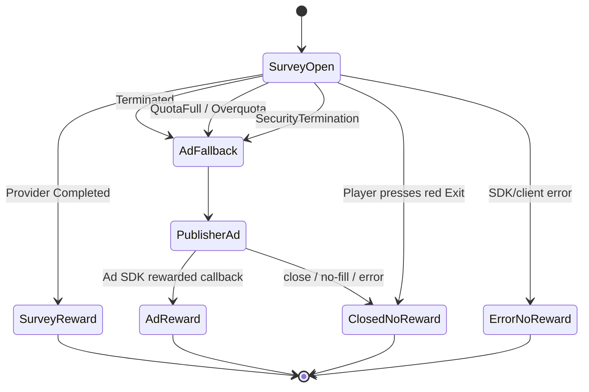

# Publisher Integration Contract

This document explains exactly what PocketsFull does and what remains the publisher's responsibility.

## 1. Integration boundary

PocketsFull owns:

- creating a survey session;
- opening and closing the survey WebView Activity;
- maintaining a stable mapping from the publisher's player ID to a PocketsFull survey UID inside that game;
- receiving the survey provider's server-to-server terminal status;
- validating/deduplicating the provider callback;
- returning one of the SDK callbacks to the game.

The publisher owns:

- the game economy and the actual reward;
- the current level/scene/checkpoint/lives/coins state;
- the existing rewarded-ad SDK or mediation stack;
- showing the rewarded ad when `onFallbackToAd` fires;
- granting an ad reward **only** when the publisher's ad SDK reports the rewarded event;
- no-fill, ad-error, ad-close, and ad-frequency logic.

PocketsFull does not initialize, load, mediate, or reward the publisher's ads.

## 2. Credentials supplied for each game

PocketsFull supplies the developer:

```text
appCode:       GAME_SPECIFIC_PUBLIC_CODE
sdkPublicKey:  GAME_SPECIFIC_CLIENT_KEY
package:       com.publisher.game
```

Do not ask for or embed the survey `appId`, survey key, provider postback token, or PocketsFull backend service credentials. Those remain server-side.

## 3. Runtime values the game sends

Each survey launch requires:

- **stable player ID** — the game's own account/user ID. A guest ID is fine if it is persisted and reused;
- **placement** — a stable placement name such as `extra_life`, `continue`, `double_coins`, `daily_reward`.

Do not generate a new player ID for every survey attempt.

## 4. Exact outcome contract



## 5. Reward safety rule

Never grant the game reward inside `onFallbackToAd`.

Correct:

```text
onFallbackToAd
    -> show existing rewarded ad
    -> wait for publisher ad SDK's rewarded callback
    -> grant reward
```

Incorrect:

```text
onFallbackToAd
    -> grant reward immediately   <-- wrong
    -> show ad
```

## 6. Game-state rule

PocketsFull opens a native Android Activity over the game. The Unity/native game Activity remains beneath it. When a terminal survey result arrives, PocketsFull closes its Activity and waits for the host Activity to resume before delivering the reward/fallback callback.

Keep the pending placement context alive until one callback resolves the attempt. Do not reload a scene or reset the level merely because the survey Activity opened or closed.

Recommended pending context:

```text
playerId
placement
current level/scene
checkpoint
reward type + amount
pending continue/life state
PocketsFull session ID (when returned)
```

## 7. Analytics recommendation

Track survey and ad rewards separately:

```text
reward_source = survey
reward_source = ad
```

`onFallbackToAd` is not an ad conversion. The conversion occurs only if the ad SDK itself reports the reward.

## 8. Support details

If reporting a problem, include game/package, player ID, placement, approximate timestamp/timezone, PocketsFull session ID if available, and what happened on-screen.
